<h1>Owasp-Juice-Shop WriteUps</h1>
<h2>Christmas Special ****</h2>
<h3>Main goal of this lab is to purchase <b>Christmas Super-Surprise-Box</b> which is hidden from FrontEnd</h3>
<h3>We need to find vulnerable parameter within the webpage to order hidden <b>Christmas Super-Surprise-Box</b> </h3>
  

This lab demonstrates how we can exploit a server using <b>Search</b> option.

In the below image we can see the home page of Owasp-Juice-Shop that we will be going to exploit. On the top right we can see <b>Search</b> option.

 

<a href="images/01.png">
 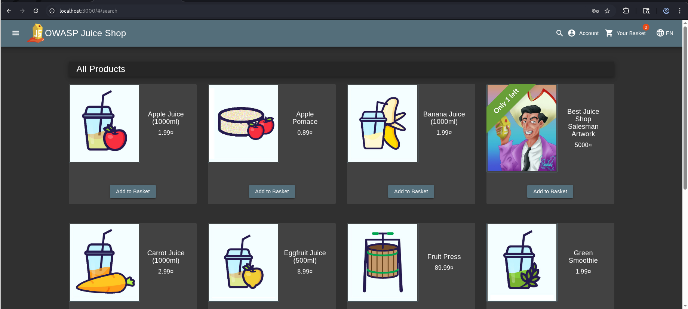
</a>
  
**Figure 1:** HomePage.

<b>Step 1:</b> We use the search option and use BurpSuite to capture the traffic to know how the <b>search</b> function is working behind the scene.

We can use <b>'--</b> paylod in the search parameter (?q) to check whether the given webpage is vulnerable to <b>SQLi</b>. Since we got 500 Internal server error now we can confirm that the search parameter is vunerable. 

 

<a href="images/02.png">
 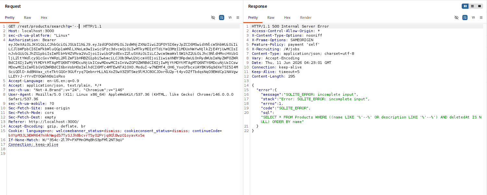
</a>
  
**Figure 2:** Inspecting Search function using BurpSuite.

<b>Step 2:</b>Since we can't find Christmas product directly , we need to use SQLi payload in search parameter to list out all hidden products. For this we use <b>'))--</b> payload.

<a href="images/03.png">
 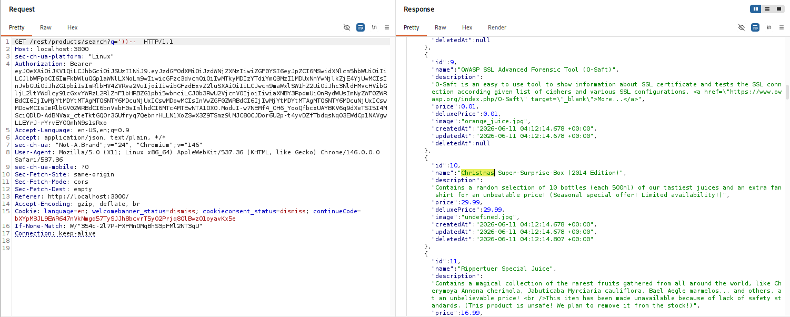
</a>
  
**Figure 3:** Using SQLi payload.

<b>Step 3:</b>From the above image we knew that the ProductID of Christmas Product is 10 which we can use later in the attack to purchase the product using BurpSuite Repeater.   > We know that we cant purchase <b>Christmas Product</b> directly from the Home page because it's hidden from the FrontEnd. What we need to do is add any products from Frontend into the basket, intercept the request using BurpSuite, and replace the ProductID with the ProductID of Christmas Product

<a href="images/04.png">
 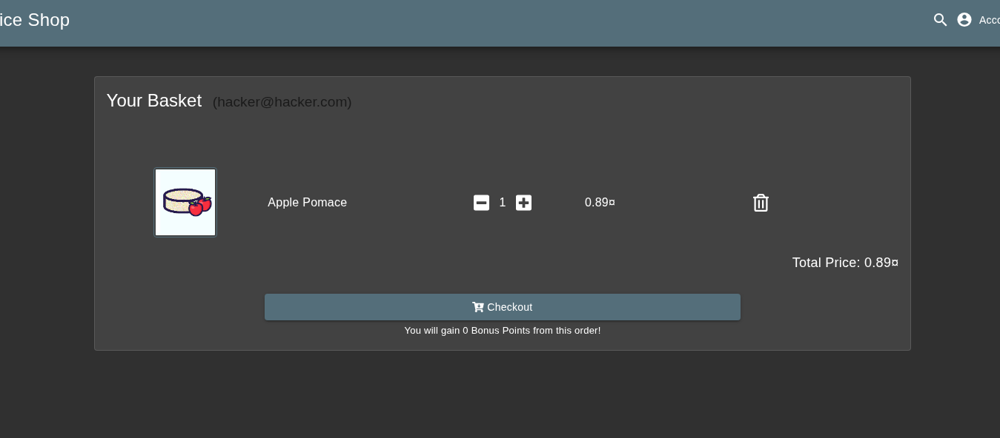
</a>
  
**Figure 4:** Adding Random Product from Frontend into the Basket.

<a href="images/05.png">
 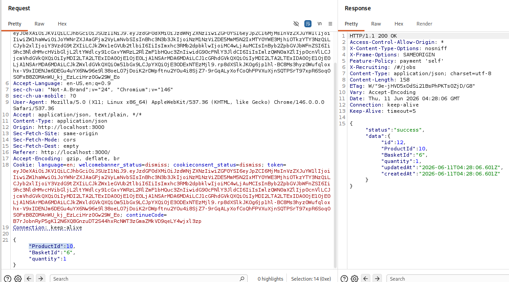
</a>
  
**Figure 5:** Using ProductID=10 to purchase Christmas Product.

After changing the ProductID=10 , we can observe in the the webpage that the Christmas Product which was hidden from the FrontEnd is now added to the Basket through which we can order and purchase that product.

<a href="images/06.png">
 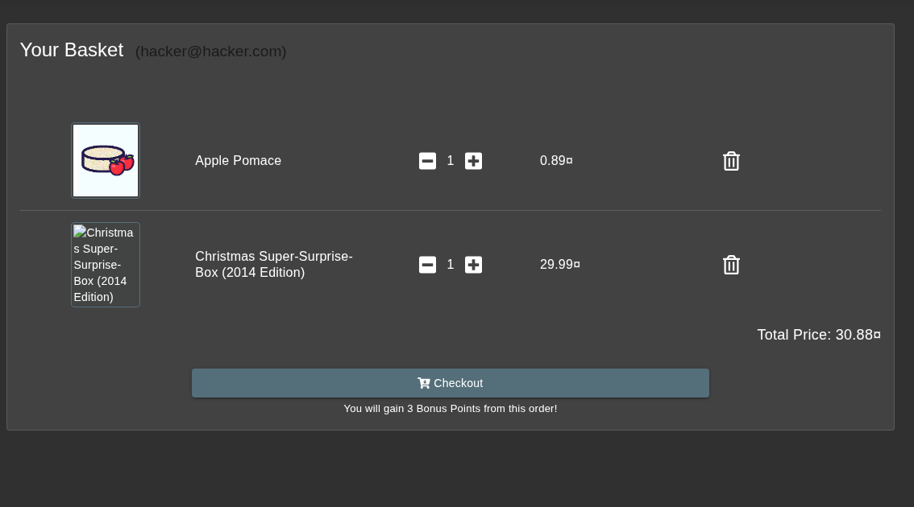
</a>
  
**Figure 6:** Christmas Product Order Section.

Now we just need to follow the payment process as show in the below images:

<a href="images/07.png">
 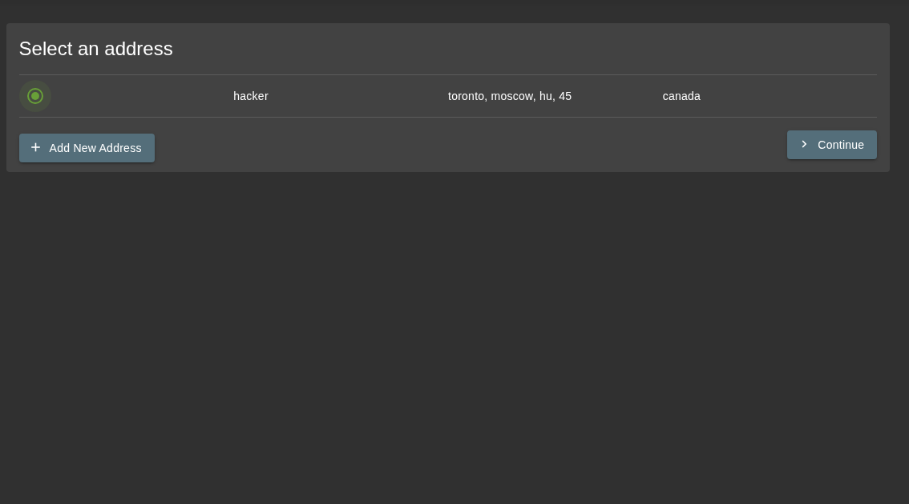
</a>

<a href="images/08.png">
 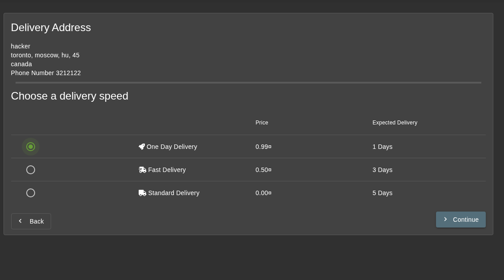
</a>

<a href="images/09.png">
 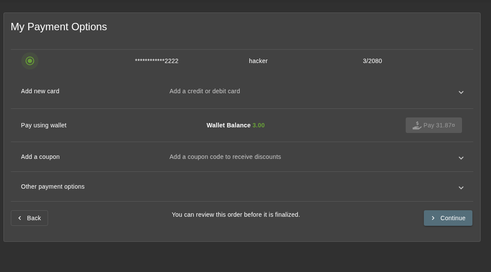
</a>

<a href="images/10.png">
 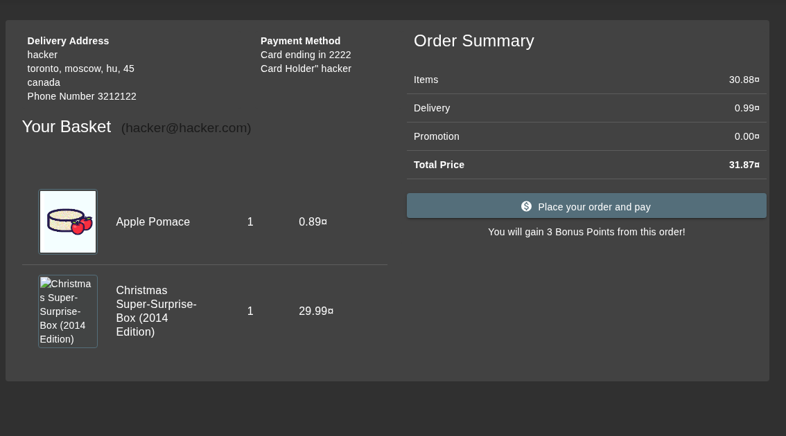
</a>

<a href="images/11.png">
 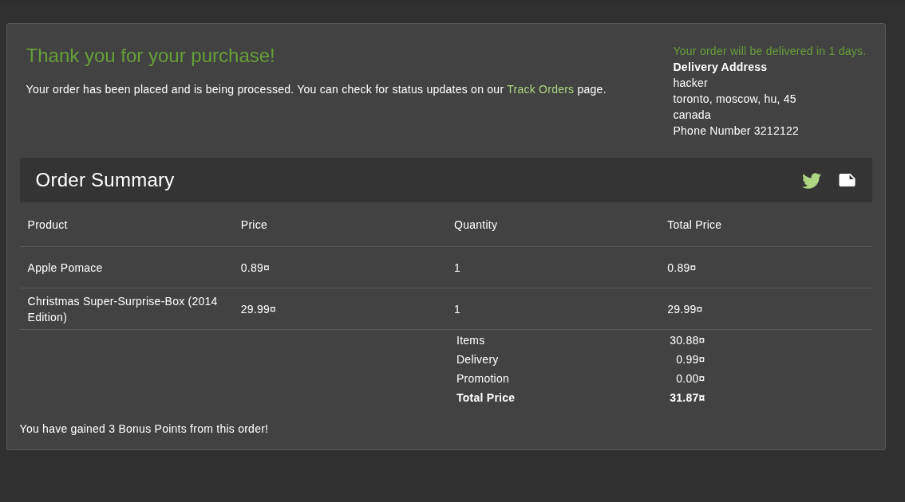
</a>
 
**Figure:** Christmas Product Payment process.

<h3>We have successfully completed this lab</h3>
