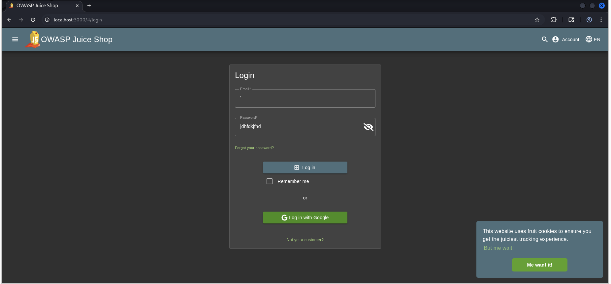
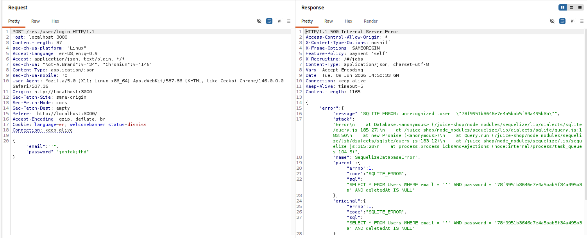
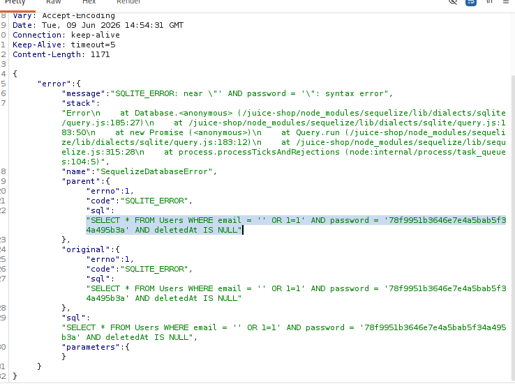
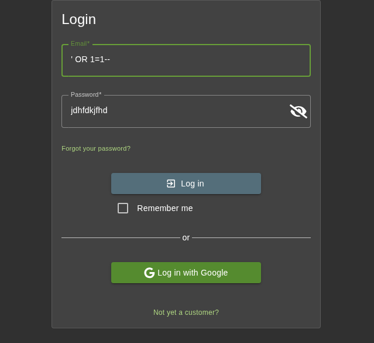
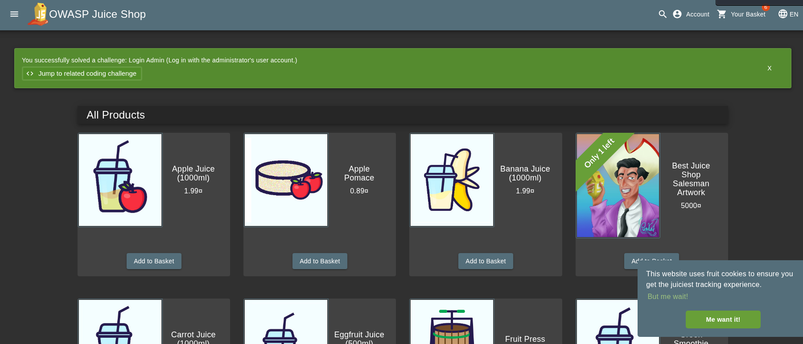

<h1>Owasp-Juice-Shop WriteUps</h1>
The main goal of this is to log in as Administrator's user account.

 Here we have the login page. At first I tried to check if the given login page is vulnerable to SQL Injection or not. To check I added single quote <b>'</b> in the email field and a random password.
 

  
**Figure 1:** Initial login page.

 After intercepting the request in Burpsuite, we can now confirm that the given login page is vulnerable to SQl Injection since we got <b>500 Internal server error</b> in the response.

 

  
**Figure 2:** Inspecting Login page.

In the next step I tried to exploit with basic SQLi payload in email field i.e. <b>' OR 1=1</b> & random password value.

 
**Figure 3:** Basic SQLi payload in email field.

We can inspect the request with the help of BurpSuite.

 
**Figure 4:** Inspecting Response using BurpSuite.

This was still not working , so i though of commenting out everything after the email value by using <b>--</b> sign. Our paylod would look like <b>' OR 1=1--</b> & random password value.

 
**Figure 5:** Updating Payload.

and as we can see this time it actually worked since we already figured out this lab was vulnerable to SQLi

 
**Figure 6:** We have access to Administrator account.

 

